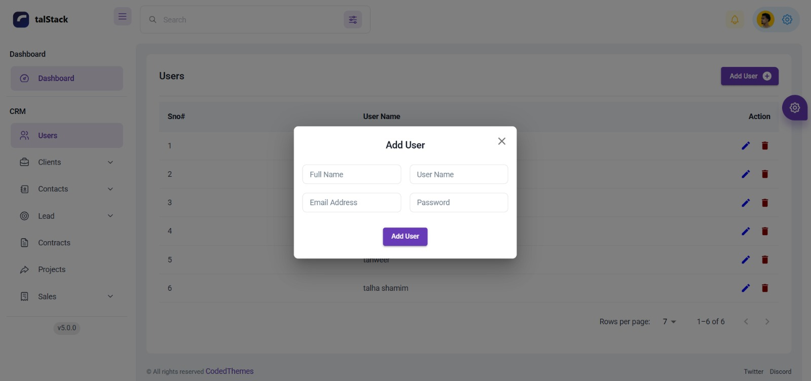
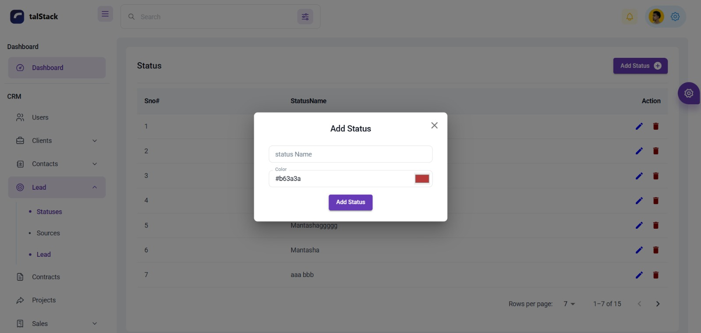
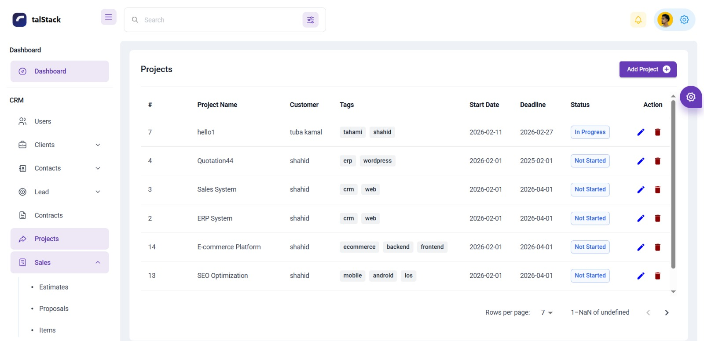
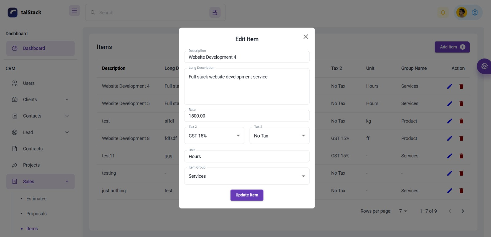
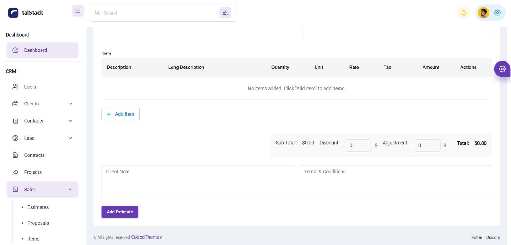
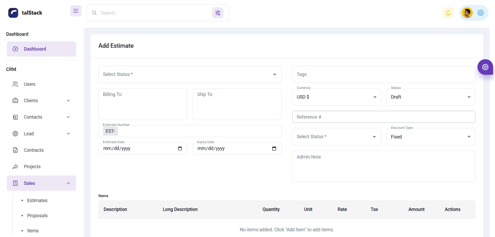
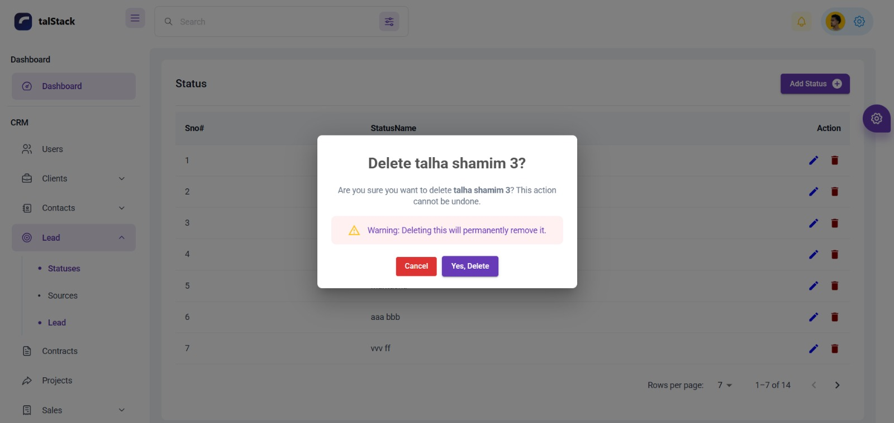
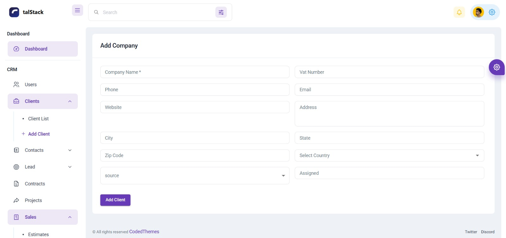
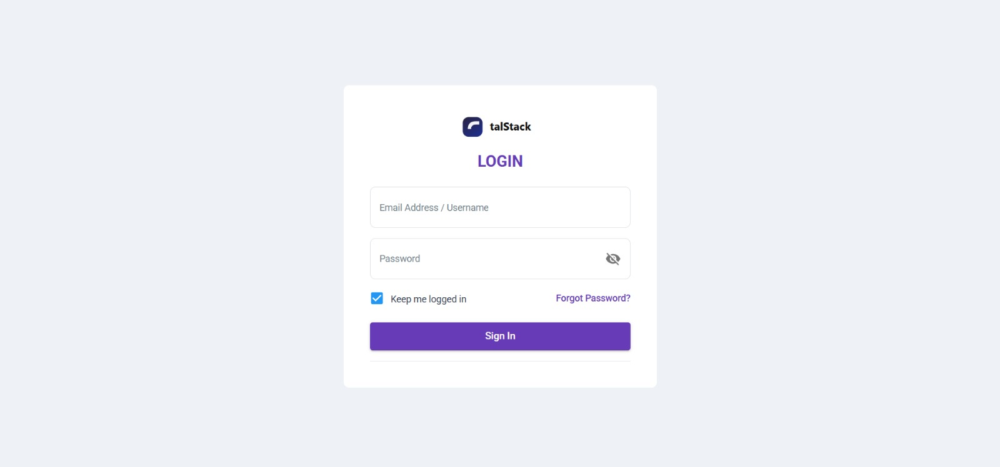

# CRM Dashboard (Full Stack)

A modern **CRM (Customer Relationship Management) Dashboard** built with a **Vite + React frontend** and **Node.js backend**.
This system helps manage customers, sales, and analytics through a clean admin dashboard.

---

# 📸 Project Preview












---

# 🚀 Features

* Customer Management
* Sales Tracking
* Dashboard Analytics
* Secure API integration
* Responsive Admin Dashboard
* Modular and scalable architecture

---

# 🛠 Tech Stack

## Frontend

* React
* Vite
* Material UI
* Axios
* React Router
* Redux
* Tailwind css
* Reusable components
* REST API Integration

## Backend

* Node.js
* Express.js
* PostgreSQL

---

# 📂 Project Structure

```
crm-dashboard
│
├── frontend
│   ├── src
│   │   ├── components
│   │   ├── pages
│   │   ├── redux
│   │   └── services
│   └── vite.config.js
│
├── backend
│   ├── controllers
│   ├── routes
│   ├── models
│   ├── middleware
│   └── server.js
│
├── README.md
└── screenshots
```

---

# ⚙️ Installation

Clone the repository

```
git clone https://github.com/yourusername/crm-dashboard.git
```

Move into project

```
cd crm-dashboard
```

---

# 🔧 Setup Backend

```
cd backend
npm install
npm start
```

Backend will run on:

```
http://localhost:8000
```

---

# 🎨 Setup Frontend

```
cd frontend
npm install
npm run dev
```

Frontend will run on:

```
http://localhost:5173
```

---

# 🔐 Environment Variables

Create `.env` file inside backend:

```
PORT=8000
POSTGRES_URI=your_database_url
JWT_SECRET=your_secret_key
```

---

# 🎯 Future Improvements

* Role based authentication
* Email notifications
* Advanced analytics charts
* CRM automation

---

# 👨‍💻 Author

Muhammad Talha

GitHub: https://github.com/engineertalhashamim

---

# 📄 License

This project is licensed under the MIT License.
